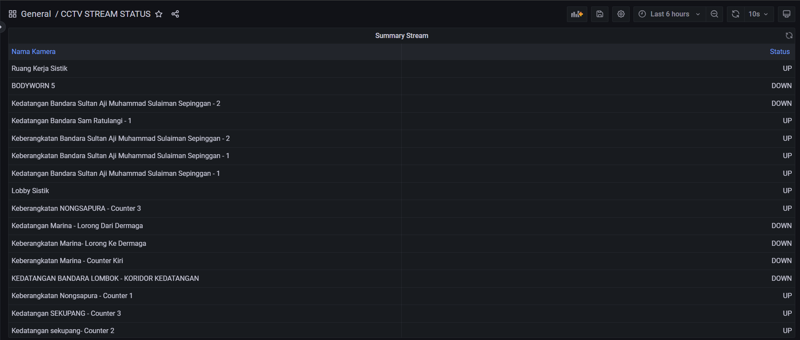
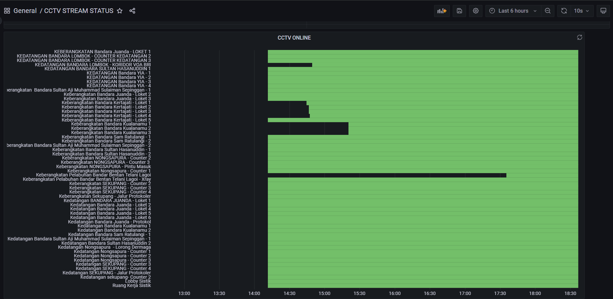

# Deploy Stream Monitoring

Ini adalah dokumentasi tambahan jika ingin monitoring stream visionaire.

## Membuat file baru
Buat dulu file `stream_monitor.py` di dalam folder v4-centralized-monitoring (folder dimana grafana - prometheus berada)
```
import requests
from prometheus_client import CollectorRegistry, Gauge, generate_latest
from http.server import BaseHTTPRequestHandler, HTTPServer
import threading
import json
import time

# --- KONFIGURASI API ---
API_BASE_URLS = [
    "http://10.0.28.11:4004",
    "http://10.10.2.19:4004",
    "http://10.10.8.19:4004",
    "http://10.5.19.19:4004",
    "http://10.2.62.19:4004",
    "http://10.5.31.19:4004",
    "http://10.5.30.19:4004",
    "http://10.5.35.19:4004" 


]
EXPORTER_PORT = 9898 
# -----------------------

def fetch_metrics():
    """
    Mengambil data status dari semua API yang dikonfigurasi dan memperbarui metrik 
    menggunakan Registry baru untuk memastikan hanya metrik terbaru yang ada.
    """
    REGISTRY_LOCAL = CollectorRegistry(auto_describe=False)
    
    # Definisikan Gauge di dalam fungsi fetch_metrics()
    STREAM_STATUS = Gauge(
        'camera_stream_status_up', 
        'Status aktif stream kamera (1=RUNNING, 0=EXCEPTION/DOWN/Lainnya)',
        ['stream_id', 'stream_name', 'node_num', 'state_text', 'source_host'],
        registry=REGISTRY_LOCAL
    )
    
    print(f"[{time.strftime('%Y-%m-%d %H:%M:%S')}] Fetching new metrics from all configured servers...")
    
    for base_url in API_BASE_URLS:
        # Ekstrak host/port untuk digunakan sebagai label identitas
        source_host = "unknown"
        try:
            source_host_port = base_url.split('//')[1]
            source_host = source_host_port.split(':')[0]
        except IndexError:
            pass
            
        try:
            # A. Hit API pertama: Ambil daftar stream
            streams_response = requests.get(f"{base_url}/streams", timeout=10)
            streams_response.raise_for_status()
            streams_data = streams_response.json()
            
        except requests.exceptions.RequestException as e:
            print(f"ERROR: Gagal mengambil daftar streams dari {base_url}: {e}")
            continue 

        # B. Iterasi dan Hit API detail untuk setiap stream
        for stream in streams_data.get('streams', []):
            stream_id = stream.get('stream_id')
            node_num = stream.get('stream_node_num')
            stream_name = stream.get('stream_name', 'UNKNOWN_STREAM')
            
            if stream_id and node_num is not None:
                detail_url = f"{base_url}/streams/{node_num}/{stream_id}"
                
                labels = {
                    'stream_id': stream_id,
                    'stream_name': stream_name,
                    'node_num': str(node_num),
                    'source_host': source_host, 
                }

                try:
                    detail_response = requests.get(detail_url, timeout=10)
                    detail_response.raise_for_status()
                    detail_data = detail_response.json()
                    
                    # C. Ekstrak Status 
                    state_text = detail_data.get('stream_stats', {}).get('state', 'UNKNOWN')
                    if state_text == 'UNKNOWN' and detail_data.get('status') and detail_data['status'].get('pipelines'):
                         state_text = detail_data['status']['pipelines'][0].get('state', 'UNKNOWN')
                    
                    # Konversi status ke metrik numerik (1 = UP, 0 = DOWN)
                    is_active = detail_data.get('active', False)
                    metric_value = 1 if state_text == 'RUNNING' and is_active is True else 0
                    
                    labels['state_text'] = state_text 
                    
                    # D. Set nilai metrik
                    STREAM_STATUS.labels(**labels).set(metric_value)
                    
                except requests.exceptions.RequestException as e:
                    print(f"WARNING: Gagal mengambil detail stream {stream_name} dari {source_host}: {e}")
                    
                    # Set status ke 0 jika terjadi kesalahan API
                    labels['state_text'] = 'API_ERROR'
                    STREAM_STATUS.labels(**labels).set(0)

    # Kembalikan registry lokal yang berisi metrik terbaru
    return REGISTRY_LOCAL


class PrometheusHandler(BaseHTTPRequestHandler):
    """Handler HTTP untuk melayani endpoint /metrics"""
    
    def do_GET(self):
        if self.path == '/metrics':
            try:
                # Dapatkan registry terbaru
                registry = fetch_metrics()
                
                self.send_response(200)
                self.send_header('Content-Type', 'text/plain; version=0.0.4; charset=utf-8')
                self.end_headers()
                self.wfile.write(generate_latest(registry))
            except Exception as e:
                print(f"CRITICAL ERROR during metric generation/response: {e}")
                self.send_response(500)
                self.end_headers()
        else:
            self.send_response(404)
            self.end_headers()

def run_exporter():
    """Menjalankan server HTTP"""
    server_address = ('', EXPORTER_PORT)
    try:
        httpd = HTTPServer(server_address, PrometheusHandler)
        print(f"Starting stream exporter on port {EXPORTER_PORT}...")
        httpd.serve_forever()
    except OSError as e:
        print(f"FATAL ERROR: Failed to bind to port {EXPORTER_PORT}. Error: {e}")

if __name__ == '__main__':
    run_exporter()

```

## Jalankan Custom Exporter
Jalankan skrip di server Anda (misalnya di server 10.0.28.11 atau di server lain yang memiliki akses ke 10.0.28.11:4004).

Penting: Karena ini adalah server web yang berjalan terus-menerus, Anda harus menjalankannya di latar belakang dan memastikannya up (misalnya menggunakan nohup, screen, atau systemd service).

```
nohup python3 stream_monitor.py &
```
Pastikan port 9898 terbuka di firewall server.

## Konfigurasi Prometheus
Pada file `prometheus.yml` (di server Prometheus), tambahkan job baru.
```
  - job_name: 'custom-stream-exporter'
    # Ganti dengan IP server tempat Anda menjalankan stream_monitor.py
    static_configs:
      - targets: ['10.0.28.11:9898']
    scrape_interval: 60s
    scrape_timeout: 45s
```

## Muat Ulang Prometheus dan Verifikasi
Muat ulang konfigurasi Prometheus.
Pergi ke Prometheus UI (/targets) dan pastikan custom-stream-exporter berstatus UP dan di-scrape dengan interval 60 detik.


>[!NOTE]
> For your information

Monitoring ini adalah membaca file jason dari API yang disediakan oleh visionaire
1. http://192.168.103.46:4004/streams : untuk mendapatkan semua stream, dan mem-parsing menjadi bentuk API untuk mendapatkan detail stream (API no. 2)
2. http://192.168.103.46:4004/streams/0/c73a1992f67961d1 : API untuk mendapatkan stream detail, yang mana Response dari API ini yang akan dijadikan acuan monitoring. `"state": "RUNNING"` ini lah yang menjadi acuan bahwa stream UP atau DOWN
   ```
   ...
     "stream_stats": {
    "fps": 15,
    "frame_height": 646,
    "frame_width": 1146,
    "last_error_msg": "Stream is running..",
    "state": "RUNNING"
   ```


>[!TIP]
>Explore sendiri untuk mendapatkan visualisasi dashboard grafana lebih baik


Contoh Dashboard Grafana (Unfinish Visualization)


